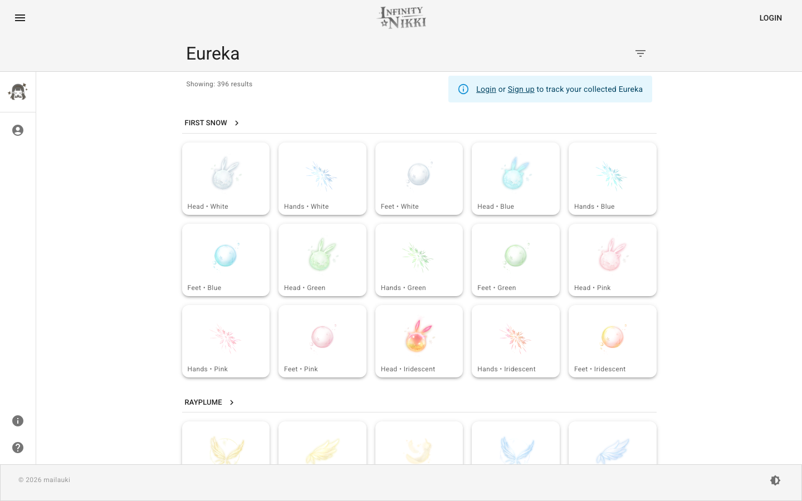
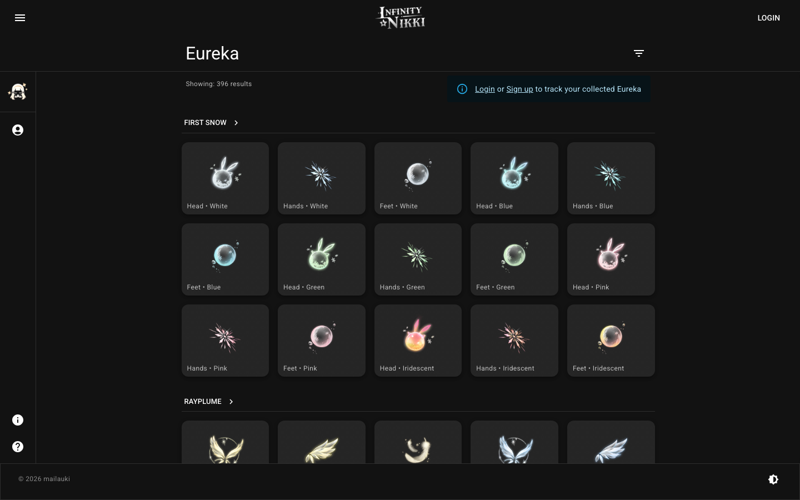

# Infinity Nikki Tracker

A collection tracker for [Infinity Nikki](https://infinitynikki.infoldgames.com/), the cozy open-world fashion game. Track your Eureka outfit progress across sets, categories, colors, and trials — with real-time updates and per-user collection state.





## Features

- **Eureka Set Tracking** — Browse all Eureka sets and mark individual pieces as obtained
- **Progress Visualization** — Per-category, per-color, and per-trial progress bars with percentages
- **Missing Items View** — Filterable list of Eureka pieces you haven't collected yet
- **Trials View** — Progress grouped by in-game trial
- **Realtime Updates** — Collection state updates instantly across tabs via Supabase Realtime
- **Auth-aware** — Browse as a guest (read-only) or sign in to track your own collection
- **Profile Management** — Update display name, username, and avatar
- **Admin Dashboard** — Manage Eureka sets and variants from the frontend (admin role required)
- **Dark/Light/System Theme** — Theme switcher in the footer

## Tech Stack

- **[Next.js 16](https://nextjs.org)** — App Router, Server Components, Server Actions
- **[Supabase](https://supabase.com)** — Postgres database, Auth (cookie-based via `@supabase/ssr`), Realtime subscriptions, Storage (avatars)
- **[MUI (Material UI)](https://mui.com)** — Component library with CSS variables and built-in dark mode
- **[Tailwind CSS](https://tailwindcss.com)** — Utility classes for layout
- **[Lucide React](https://lucide.dev)** — Icons

## Getting Started

### Prerequisites

- Node.js 18+
- Yarn
- A [Supabase](https://supabase.com) project

### Setup

1. Clone the repository and install dependencies:

   ```bash
   yarn install
   ```

2. Create `.env.local` with your Supabase credentials:

   ```env
   NEXT_PUBLIC_SUPABASE_URL=your-supabase-project-url
   NEXT_PUBLIC_SUPABASE_PUBLISHABLE_KEY=your-supabase-anon-or-publishable-key
   ```

   Both values can be found in your [Supabase project's API settings](https://supabase.com/dashboard/project/_?showConnect=true).

3. Start the development server:

   ```bash
   yarn dev
   ```

   The app will be running at [localhost:3000](http://localhost:3000).

## Scripts

| Command         | Description                    |
| --------------- | ------------------------------ |
| `yarn dev`      | Start the development server   |
| `yarn build`    | Build for production           |
| `yarn start`    | Start the production server    |
| `yarn lint`     | Run ESLint                     |
| `yarn lint:fix` | Run ESLint with auto-fix       |
| `yarn format`   | Format all files with Prettier |

## Project Structure

```
app/
  (main)/               # Main app (nav drawer layout)
    page.tsx              # Home / hero
    eureka/
      page.tsx            # All Eureka sets + overall progress
      [slug]/             # Individual set detail with realtime updates
      missing/            # Filterable missing items (auth required)
      trials/             # Progress grouped by trial
    (admin)/              # Admin section (admin role required)
      dashboard/          # Stat cards + recent lists for sets and variants
      eureka-set/         # Eureka sets table, add, and edit pages
      eureka-variant/     # Eureka variants table, add, and edit pages
    profile/              # User profile (auth required)
    about/                # About page
  auth/                   # Auth pages (login, sign-up, etc.)

components/
  navbar/                 # Nav drawer, tabs, user menu, theme switcher
  realtime/               # Realtime-subscribed client components
  forms/
    auth/                 # Profile, forgot-password, update-password forms
    eureka-set/           # Add and edit eureka set forms
    eureka-variant/       # Add and edit eureka variant forms

lib/
  data.ts                 # All Supabase data fetching (React cache)
  utils.ts                # cn(), toEurekaSlug(), toEurekaVariantSlug() helpers
  theme.ts                # MUI theme configuration
  nav-links.tsx           # Navigation link definitions
  supabase/               # Supabase client factories (server, client, proxy)
  types/                  # TypeScript interfaces and generated DB types

hooks/
  user.ts                 # getUserID(), getUserClaims(), getUserRole() — server-side auth
  eureka-set.ts           # createEurekaSet(), updateEurekaSet() — data transforms
  count.ts                # countObtained(), percent() — progress calculation
```

## Database Schema

| Table             | Description                                                        |
| ----------------- | ------------------------------------------------------------------ |
| `eureka_sets`     | Outfit set metadata (name, slug, quality, style, labels, trial)    |
| `eureka_variants` | Individual Eureka items (set FK, color, category, image_url, slug) |
| `categories`      | Category lookup with images                                        |
| `colors`          | Color lookup with images                                           |
| `obtained`        | Per-user collection records                                        |
| `trials`          | Trial lookup with images                                           |
| `profiles`        | User profiles (full_name, username, avatar_url, role)              |

## Authentication

The app uses Supabase Auth with cookie-based sessions. The middleware in `lib/supabase/proxy.ts` handles session refresh on every request. Public routes (`/`, `/eureka/**`, `/about`) are accessible without signing in — users just won't see progress tracking until they authenticate.

Roles are stored in the `profiles` table. Admin role is required to access the dashboard.
