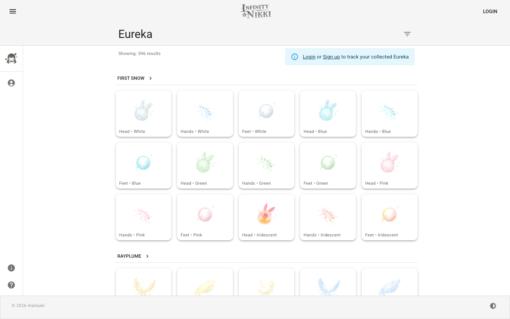
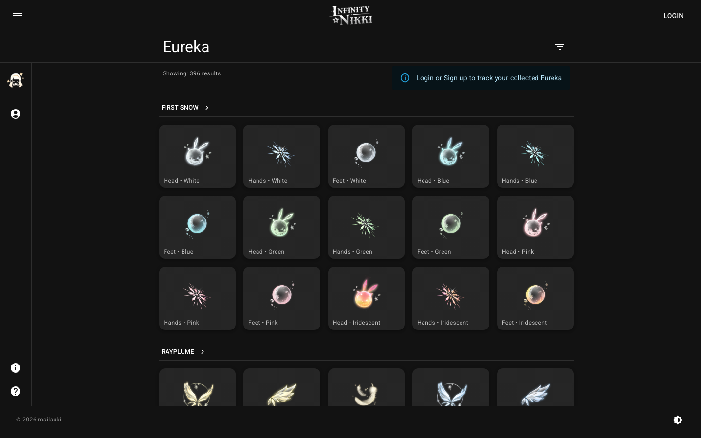

# Infinity Nikki Tracker

A collection tracker for [Infinity Nikki](https://infinitynikki.infoldgames.com/), the cozy open-world fashion game. Track your Eureka outfit progress across sets, categories, colors, and trials — with real-time updates and per-user collection state.





## Features

- **Eureka Set Tracking** — Browse all Eureka sets and mark individual pieces as obtained
- **Progress Visualization** — Per-category, per-color, and per-trial progress bars with percentages
- **Missing Items View** — Filterable list of Eureka pieces you haven't collected yet
- **Trials View** — Progress grouped by in-game trial
- **Filter & Sort** — Filter by category, color, rarity, obtained status, and eureka set; group by set or color
- **Realtime Updates** — Collection state updates instantly across tabs via Supabase Realtime
- **Auth-aware** — Browse as a guest (read-only) or sign in to track your own collection
- **Profile Management** — Update display name, username, and avatar
- **Admin Dashboard** — Manage Eureka sets, variants, and trials from the frontend (admin role required)
- **Dark/Light/System Theme** — Theme switcher in the footer

## Tech Stack

- **[Next.js 16](https://nextjs.org)** — App Router, Server Components, Server Actions, Partial Prerendering (`cacheComponents`)
- **[Supabase](https://supabase.com)** — Postgres database, Auth (cookie-based via `@supabase/ssr`), Realtime subscriptions, Storage (avatars and game images)
- **[MUI (Material UI)](https://mui.com)** — Component library with CSS variables and built-in dark mode
- **[Tailwind CSS](https://tailwindcss.com)** — Utility classes for layout
- **[MUI Icons](https://mui.com/material-ui/material-icons/)** — Icons (`@mui/icons-material`)

## Getting Started

### Prerequisites

- Node.js 18+
- Yarn
- A [Supabase](https://supabase.com) project

### Setup

1. Clone the repository and install dependencies:

   ```bash
   yarn install
   ```

2. Create `.env.local` with your Supabase credentials:

   ```env
   NEXT_PUBLIC_SUPABASE_URL=your-supabase-project-url
   NEXT_PUBLIC_SUPABASE_PUBLISHABLE_KEY=your-supabase-anon-or-publishable-key
   ```

   Both values can be found in your [Supabase project's API settings](https://supabase.com/dashboard/project/_?showConnect=true).

3. Start the development server:

   ```bash
   yarn dev
   ```

   The app will be running at [localhost:3000](http://localhost:3000).

## Scripts

| Command         | Description                    |
| --------------- | ------------------------------ |
| `yarn dev`      | Start the development server   |
| `yarn build`    | Build for production           |
| `yarn start`    | Start the production server    |
| `yarn lint`     | Run ESLint                     |
| `yarn lint:fix` | Run ESLint with auto-fix       |
| `yarn format`   | Format all files with Prettier |

## Database Schema

| Table             | Description                                                                                    |
| ----------------- | ---------------------------------------------------------------------------------------------- |
| `eureka_sets`     | Outfit set metadata (title, slug, rarity, style, label, trial) — FKs use slug columns          |
| `eureka_variants` | Individual Eureka items (eureka_set slug FK, color slug FK, category slug FK, image_url, slug) |
| `categories`      | Category lookup with images (slug-keyed)                                                       |
| `colors`          | Color lookup with images (slug-keyed)                                                          |
| `styles`          | Style lookup (unique titles + slugs, FK target for `eureka_sets.style`); RLS enabled           |
| `labels`          | Label lookup (unique titles + slugs, FK target for `eureka_sets.label`); RLS enabled           |
| `obtained_eureka` | Per-user collection records (user_id, eureka_set slug, category slug, color slug)              |
| `trials`          | Trial lookup with images and slug (FK target for `eureka_sets.trial`)                          |
| `profiles`        | User profiles (full_name, username, avatar_url, role: 'user' \| 'admin')                       |

## Authentication

The app uses Supabase Auth with cookie-based sessions. The middleware in `lib/supabase/proxy.ts` handles session refresh on every request. Public routes (`/`, `/eureka/**`, `/about`) are accessible without signing in — users just won't see progress tracking until they authenticate.

Roles are stored in the `profiles` table. Admin role is required to access the dashboard.
