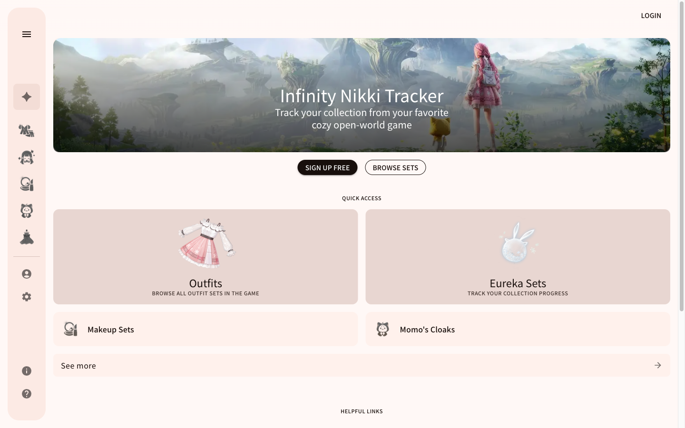
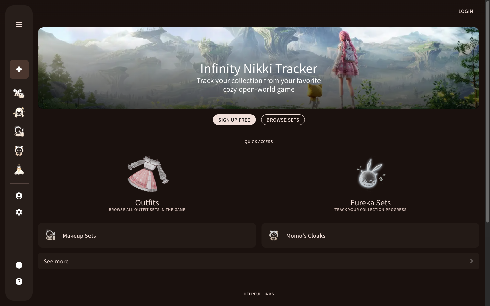

# Infinity Nikki Tracker

A fan-made collection tracker for **Infinity Nikki** — see your outfits, eureka sets, makeup, and Momo's cloaks at a glance, track your progress, and know exactly what you're still missing.

🔗 **[infinity-nikki-tracker.vercel.app](https://infinity-nikki-tracker.vercel.app/)**





---

## Why This Exists

Infinity Nikki has a built-in collection view, but it doesn't give you a clear picture of your overall progress — how complete each set is, which variants you're missing, or where you stand without clicking around. This tracker solves that, across outfits, eureka, makeup, and Momo's cloaks.

It lives outside the game, so you can check your collection status any time, even when you're not playing.

---

## Features

### Collections

- **Outfits** — track full outfit sets along with their evolutions and glow-ups; group by set or view variants individually, filter by evolution stage, category, or rarity, and toggle alternate artwork
- **Seasons** — explore outfits by season, grouped by location, with each season's categories and set counts at a glance
- **Eureka** — browse every Eureka set and its individual pieces, organized by style and rarity; switch to a by-color view or filter to a single set
- **Trials** — see how far along you are in each in-game Eureka trial
- **Makeup** — track makeup sets and their variants by category
- **Momo's Cloaks** — track Momo's cloaks, filter by location, and view alternate artwork

### Tracking

- **Mark what you have** — tap any item from the grid or its detail page to mark it obtained; progress updates instantly
- **See what's missing** — set completion status to _Missing_ to filter down to only what you haven't collected yet
- **Filter and sort** — narrow by category, color, rarity, evolution, season, or completion status, and adjust grouping, density, and sort order
- **Profile stats** — completion charts and recent updates across Outfits, Eureka, Makeup, and Momo's Cloaks
- **Public profiles** — share your collection at `/u/your-username`

### Personalization

- **Custom Looks** — mix and match Eureka and outfit pieces into your own named looks with thumbnail previews
- **Settings** — set a display name, username, and avatar; choose light, dark, or system mode; pick a default sort order and color theme
- **Install as an app** — add the tracker to your home screen as a PWA
- **Use it as a guest or sign in** — browse freely without an account, or sign in to save and track your own personal collection

### Feedback

- **Report an issue or request a feature** — built-in feedback form with image uploads, reachable from the footer or scoped to the page you're on

---

## Getting Started

No installation needed — just open the tracker in your browser:

**[infinity-nikki-tracker.vercel.app](https://infinity-nikki-tracker.vercel.app/)**

To save your collection progress, create a free account or sign in. Guests can browse all sets and variants without signing in, but progress won't be saved.

---

## Project Status

✅ **Live** — the tracker is up and running.

This project is actively maintained. Planned additions include:

- [ ] Search — quickly find sets and variants by name
- [ ] Outfit Pieces — tracking support for pieces not part of any outfit set
- [ ] Favorites — save your favorite sets and pieces
- [ ] Friends — follow friends to compare collection progress
- [ ] Sharing — shareable links to your looks and collection

---

## Support

If you enjoy using the tracker and want to support its continued development, a coffee would be greatly appreciated!

[](https://buymeacoffee.com/mailauki)

There's also a one-time supporter upgrade in the app, which unlocks extra color themes (Moonlight, Cherry Blossom, Forest), a custom profile banner, and unlimited Custom Looks. Everything else in the tracker is free.

---

## For Developers

### Tech Stack

- **[Next.js 16](https://nextjs.org)** — App Router, Server Components, Server Actions, Cache Components (PPR)
- **[React 19](https://react.dev)**
- **[Supabase](https://supabase.com)** — Postgres database, Auth, Storage, row-level security
- **[MUI (Material UI) v9](https://mui.com)** — Component library with CSS variables and built-in dark mode, plus X Data Grid (admin tables) and X Charts (collection stats)
- **[Tailwind CSS](https://tailwindcss.com)** — Utility classes for layout
- **[Stripe](https://stripe.com)** — Checkout + webhook for the supporter upgrade
- **[Vitest](https://vitest.dev)** — Unit tests
- Deployed on **[Vercel](https://vercel.com)**

### Prerequisites

- Node.js 20+
- Yarn (this project uses Yarn 4 — not npm or pnpm)
- A [Supabase](https://supabase.com) project
- A [Stripe](https://stripe.com) account (only needed for the supporter upgrade flow)

### Getting Started

1. Clone the repository and install dependencies:

   ```bash
   git clone https://github.com/mailauki/infinity-nikki-tracker.git
   cd infinity-nikki-tracker
   yarn install
   ```

2. Create `.env.local` with your Supabase credentials:

   ```env
   NEXT_PUBLIC_SUPABASE_URL=your-supabase-project-url
   NEXT_PUBLIC_SUPABASE_PUBLISHABLE_KEY=your-supabase-anon-or-publishable-key
   SUPABASE_SERVICE_ROLE_KEY=          # server-only; used by API routes / webhooks
   NEXT_PUBLIC_SITE_URL=               # absolute base URL for redirects (falls back to VERCEL_URL)

   # Only needed for the supporter upgrade flow
   STRIPE_SECRET_KEY=
   NEXT_PUBLIC_STRIPE_PUBLISHABLE_KEY=
   STRIPE_PRICE_ID=
   STRIPE_WEBHOOK_SECRET=
   ```

   The Supabase values can be found in your [Supabase project's API settings](https://supabase.com/dashboard/project/_?showConnect=true), and the Stripe values in your [Stripe dashboard](https://dashboard.stripe.com/apikeys).

3. Start the development server:

   ```bash
   yarn dev
   ```

   The app will be running at [localhost:3000](http://localhost:3000).

### Scripts

| Command           | Description                    |
| ----------------- | ------------------------------ |
| `yarn dev`        | Start the development server   |
| `yarn build`      | Build for production           |
| `yarn start`      | Start the production server    |
| `yarn lint`       | Run ESLint                     |
| `yarn lint:fix`   | Run ESLint with auto-fix       |
| `yarn format`     | Format all files with Prettier |
| `yarn test`       | Run the Vitest suite           |
| `yarn test:watch` | Run Vitest in watch mode       |

### Contributing

Contributions are welcome! If you've spotted a missing set, a bug, or have a feature idea:

1. [Open an issue](https://github.com/mailauki/infinity-nikki-tracker/issues) to discuss the change
2. Fork the repo and create a branch for your changes
3. Submit a pull request with a clear description of what you've done

For small fixes, feel free to open a PR directly.

---

## Disclaimer

This is a fan-made project and is not affiliated with, endorsed by, or officially connected to Papergames or the Infinity Nikki development team. All game content, names, and assets are the property of their respective owners.
